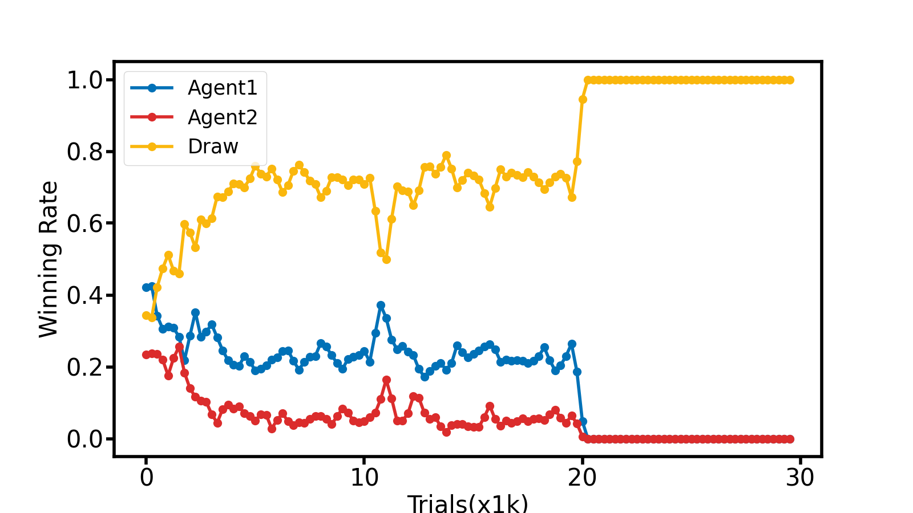

# Tic-Tac-Toe with Reinforcement Learning

This project implements two AI agents that play Tic-Tac-Toe against each other using Reinforcement Learning. The implementation follows the methodology from the following repository:

**Credit to:** [PenicillinLP/OOXX: Python code for Reinforcement Learning of Tic Tac Toe](https://github.com/PenicillinLP/OOXX)

## Overview

The project trains two agents using a value-based reinforcement learning approach. The agents learn to optimize their gameplay through an epsilon-greedy strategy and temporal difference (TD) updates. Over multiple training iterations, they improve their decision-making to maximize their chances of winning.

## Implementation Details

- **Agent Class:** Implements the reinforcement learning agent with an epsilon-greedy strategy for decision-making and TD learning for value updates.
- **Judge Function:** Determines the game outcome by checking win conditions for both agents.
- **Training Loop:** Runs a specified number of training games where agents take turns making moves, learning from their outcomes.
- **Performance Visualization:** Uses Matplotlib to plot the win rates of both agents and the frequency of drawn games over training iterations.

## Result

